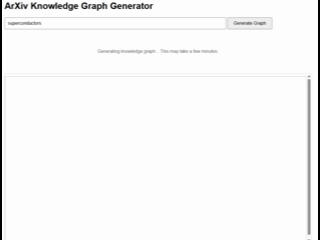
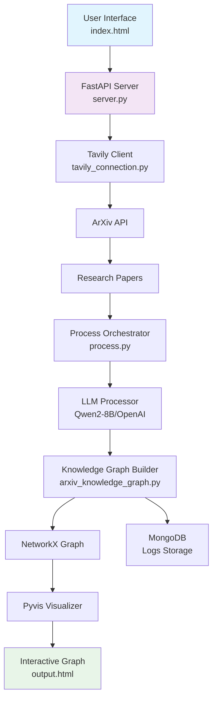
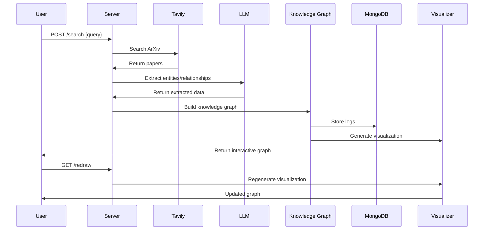

# ArXiv Knowledge Graph Generator

A FastAPI web application that searches ArXiv papers using Tavily and generates interactive knowledge graphs by extracting entities and relationships using LLMs. Features real-time graph visualization with Pyvis.

<video src="./demo/arvix_graph.mp4" controls width="800" preload="metadata" style="max-width: 100%;">
  Your browser does not support the video tag.
  <a href="./demo/arvix_graph.mp4">Download the video</a> instead.
</video>




## Features

- **🔍 ArXiv-Exclusive Search**: Restricted search to ArXiv academic papers via Tavily API
- **🧠 LLM-Powered Extraction**: Uses Qwen2-8B (configurable to OpenAI) for entity and relationship extraction
- **📊 Interactive Visualization**: Pyvis-powered dynamic graph visualization
- **💾 Data Persistence**: Local graph storage with MongoDB for logs
- **🚀 RESTful API**: FastAPI backend with comprehensive endpoints
- **🔄 Real-time Updates**: Live graph redrawing and node management

## System Architecture



# Installation
Prerequisites
Python 3.8+

MongoDB (local or Atlas)

Tavily API key

LLM access (Qwen2-8B or OpenAI)

### 1.Setup
Clone the repository
```
git clone <repository-url>
cd arxiv-knowledge-graph-generator
```

### 2.Install Dependencies
```
pip install -r requirements.txt
```

### 3. Environment Configuration
```
TAVILY_API_KEY=your_tavily_api_key_here
OPENAI_API_KEY=your_openai_api_key_here  # Optional if using Qwen2-8B
MONGODB_URI=mongodb://localhost:27017
DATABASE_NAME=arxiv_knowledge_graph
LOG_DATABASE=logging_db
```

# Usage
### Starting the Application
```
uvicorn server:app --reload --host 0.0.0.0 --port 80
```

# API Endpoints
### Core Endpoints
| Method	|Endpoint	|Description |
| --- | --- | --- |
| GET	|/	|Serve main application page
| POST	|/search	|Search ArXiv and generate knowledge graph
| GET	|/graph	|Retrieve current graph data
| GET	|/redraw	|Redraw the graph visualization
| GET	|/get-node/{node_id}	|Get detailed information for a specific node
| DELETE	|/delete-node/{node_id}	|Remove a node from the graph


# API Usage Examples
```
import requests

# Search for papers and generate graph
search_response = requests.post("http://localhost:8000/search", json={
    "query": "quantum machine learning",
    "max_papers": 10,
    "max_entities_per_paper": 15
})

# Get graph data
graph_data = requests.get("http://localhost:8000/graph")

# Redraw graph
redraw_response = requests.get("http://localhost:8000/redraw")

# Get node information
node_info = requests.get("http://localhost:8000/get-node/1")

# Delete node
delete_response = requests.delete("http://localhost:8000/delete-node/1")
```


# Dependencies
Key dependencies include:

- fastapi - Web framework
- uvicorn - ASGI server
- tavily-python - ArXiv search
- pyvis - Graph visualization
- networkx - Graph operations
- pymongo - MongoDB connection
- transformers / openai - LLM integration

